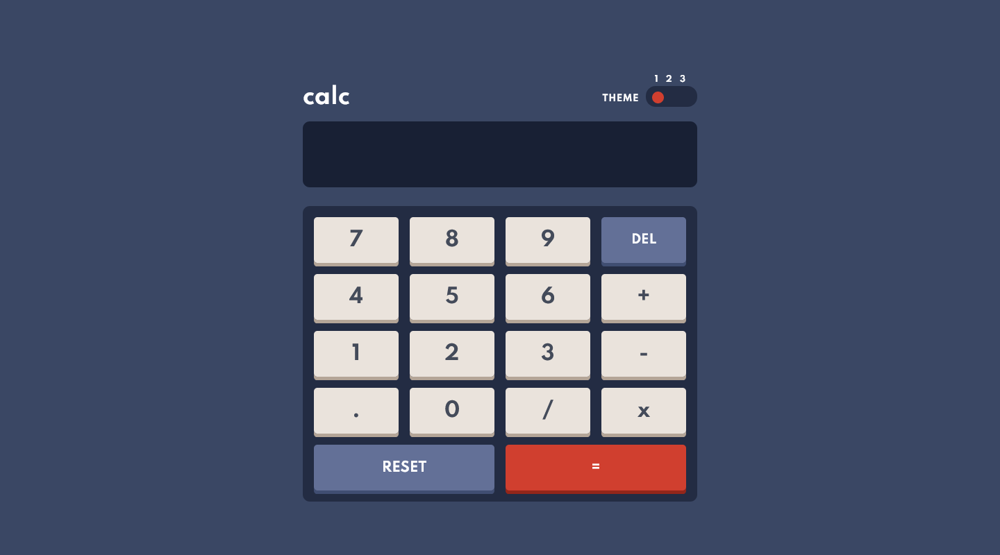
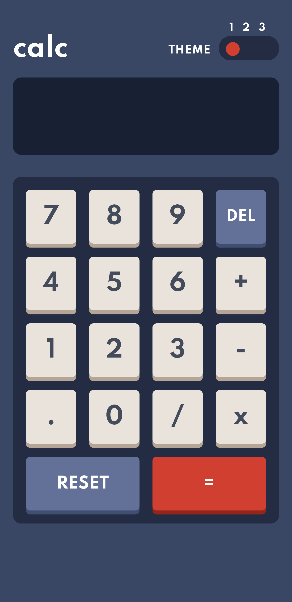

# Frontend Mentor - Calculator app solution

This is a solution to the [Calculator app challenge on Frontend Mentor](https://www.frontendmentor.io/challenges/calculator-app-9lteq5N29). Frontend Mentor challenges help you improve your coding skills by building realistic projects.

## Table of contents

- [Screenshot](#screenshot)
  - [Desktop View](#Desktop-View)
  - [Mobile View](#Mobile-View)
- [Links](#links)
- [Built with](#built-with)
- [What I Learned] (#What-i-learned)
- [Author](#author)

### Screenshot

### Desktop-View



### Mobile-View



### Links

- Solution URL: [Github](https://github.com/MohtashimAli85/calculator-app-main)
- Live Site URL: [Live](https://calculator-app-main-nine.vercel.app/)

### Built with

- Semantic HTML5 markup
- CSS custom properties
- CSS Grid
- SCSS
- Mobile-first workflow
### What I Learned
I learned about the eval() function that evaluates JS code represented as a string.

```
console.log(eval('2+2))
//expected output: 4
```

Now executing 0.1 + 0.2 == 0.3 ? in **JavaScript**. Sadly, It will return **false** due to round-off error and doest not return exactly 0.3.
So the solution to this is that multiply floats into integers before you calculate, then divide them back.

`(0.2 * 100 + 0.01 * 100) / 100 // returns 0.21`

Well, I first evaluated the input then i check if the answer includes floating point then perform the following code:
```
result = Math.round(result * 100) / 100;
```


## Author

- Frontend Mentor - [@MohtashimAli85](https://www.frontendmentor.io/profile/MohtashimAli85)
